# STONE — продуктовый аудит Residential и Commercial

Дата наблюдения: 10 сентября 2026 г.

## 1. Рамка и способ чтения

Цель аудита — выявить наблюдаемые барьеры в пути `visit → application → qualified lead → sale`, не подменяя продуктовые данные субъективной оценкой интерфейса.

В документе используются три строго разные категории:

- **FACT** — буквально наблюдаемое состояние интерфейса или его поведения в текущем прохождении;
- **INFERENCE** — возможное следствие наблюдения; это не доказанная пользовательская проблема и не причинный вывод;
- **UNKNOWN** — вопрос, который нельзя закрыть интерфейсным аудитом и для которого нужны аналитика, CRM-данные или исследование.

Уверенность ниже относится к качеству наблюдения. Даже при высокой уверенности в FACT поведенческое следствие остаётся inference, пока не подтверждено данными.

### Контур проверки

- Residential: `https://stone.ru/residential`, каталог квартир, фильтры, СТОУН Сокольники, лот C-006, избранное, выбор канала и форма обратного звонка.
- Commercial: `https://stone.ru/commercial`, каталог офисов, фильтры, STONE Дмитровская, офисный блок SD-2000-2100, избранное, выбор канала и форма обратного звонка.
- Общий journey: `Entry → Discovery → Narrowing / Filters → Evaluation → Comparison / Shortlist → Application`.
- Residential проверен в узком viewport 407×622 / 422×645, близком к мобильному; Commercial — в desktop viewport 1265×712 / 1280×720.
- Сценарий анонимный, без входа в личный кабинет. Формы не отправлялись; переходы во внешние мессенджеры не выполнялись.

### Скриншоты journey в порядке прохождения

**Residential, шаг 1 — Entry**

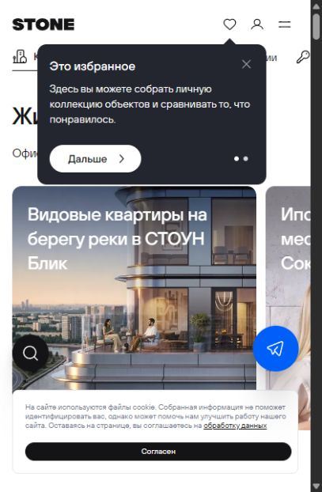

**Residential, шаг 2 — Discovery / каталог**

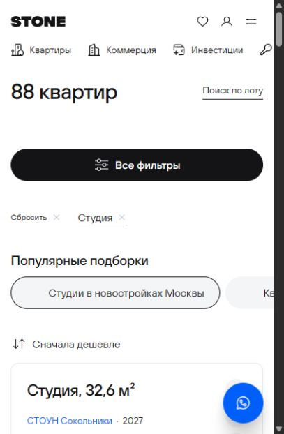

**Residential, шаг 3 — Narrowing / Filters**

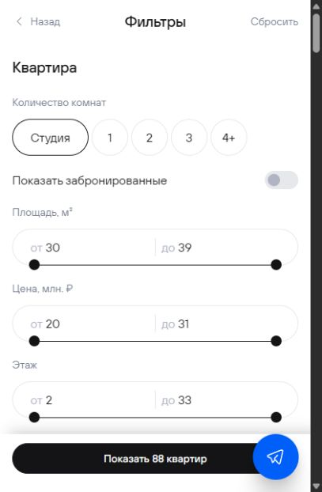

**Residential, шаг 4 — Evaluation проекта и лота**

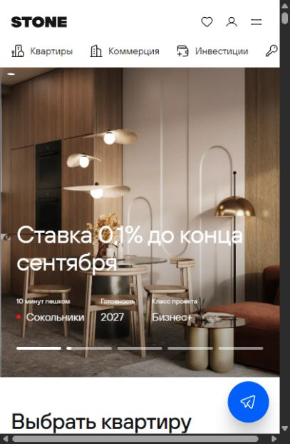

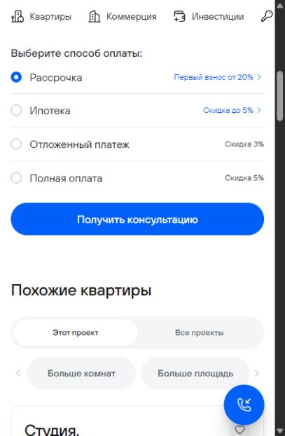

**Residential, шаг 5 — Comparison / Shortlist**

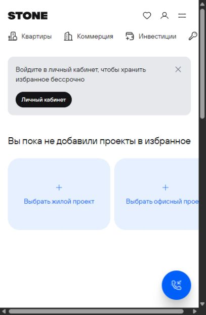

**Residential, шаг 6 — Application**

**Commercial, шаг 1 — Entry**

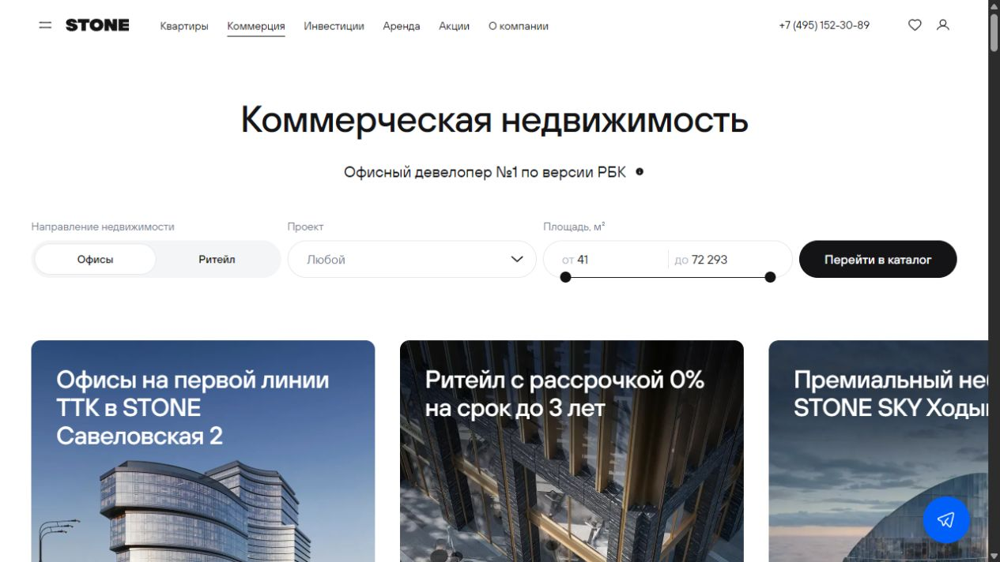

**Commercial, шаг 2 — Discovery / каталог**

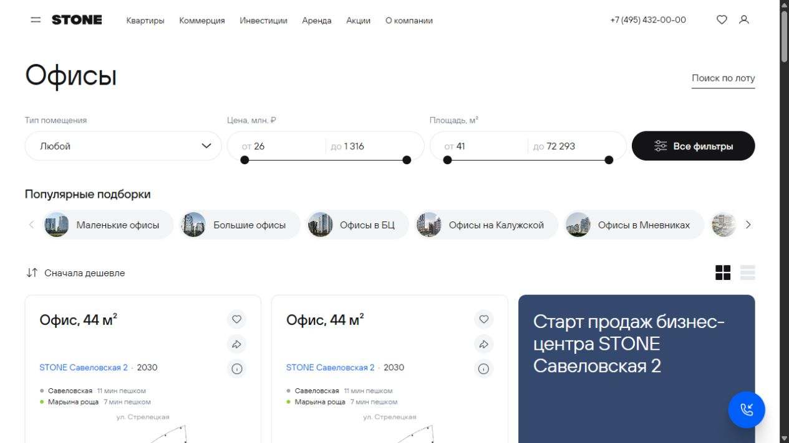

**Commercial, шаг 3 — Narrowing / Filters**

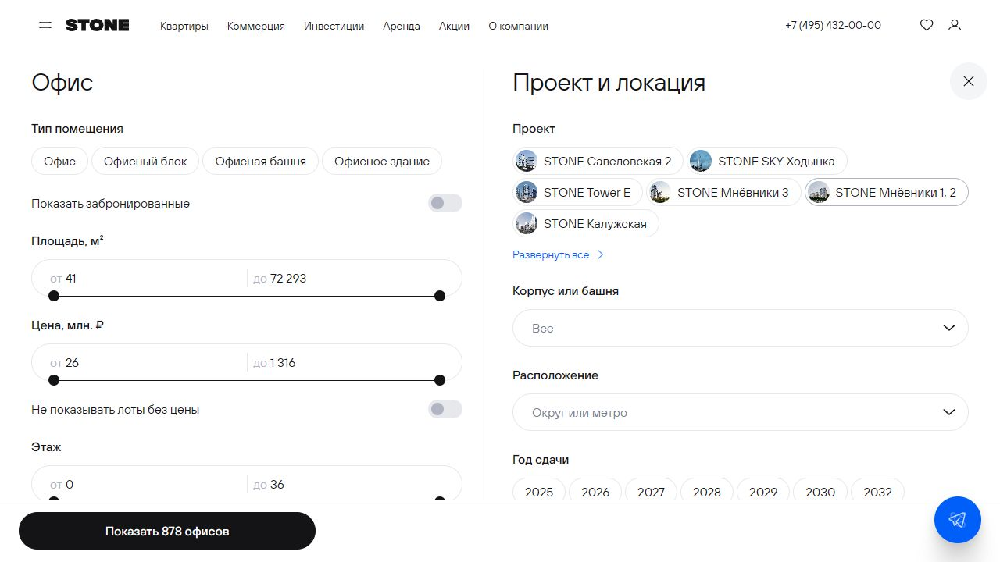

**Commercial, шаг 4 — Evaluation проекта и лота**

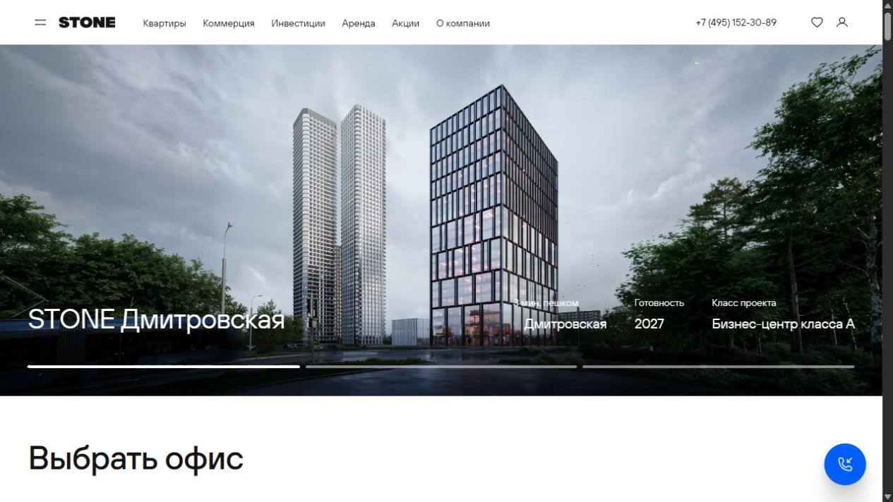

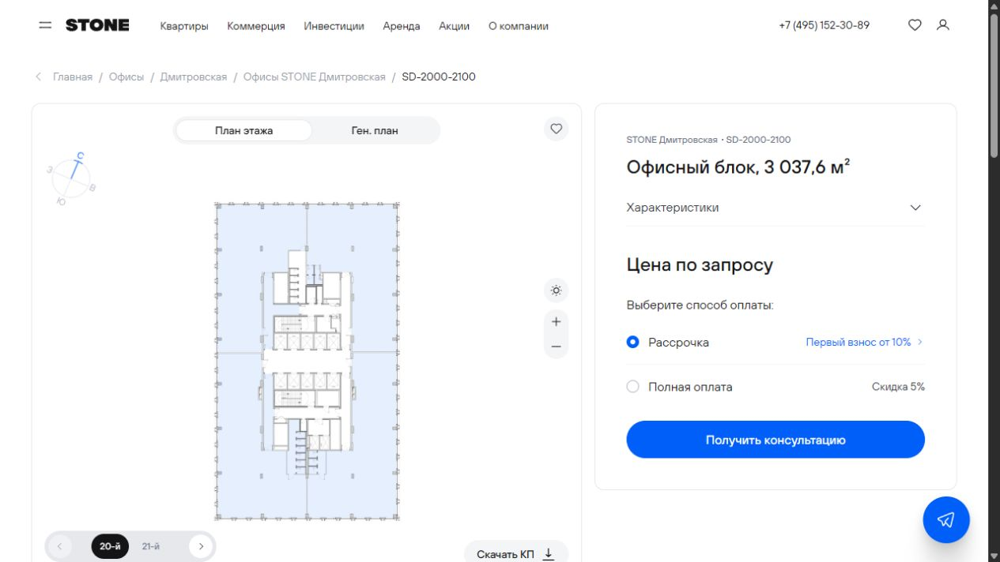

**Commercial, шаг 5 — Comparison / Shortlist**

**Commercial, шаг 6 — Application**

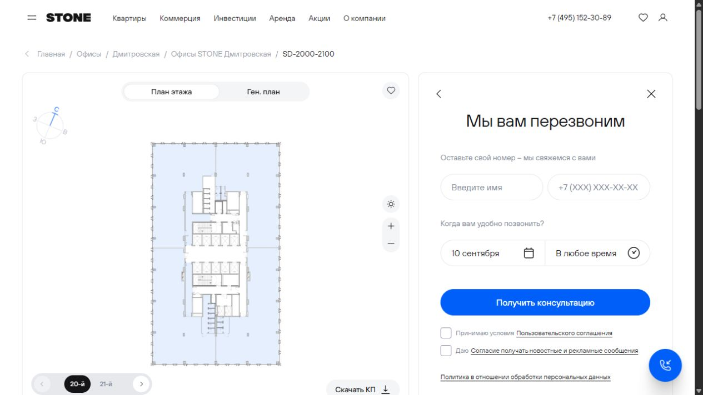

## 2. Executive summary

Residential даёт подробную информацию о проекте, лоте и вариантах оплаты, а фильтры сохраняют выбранный контекст и показывают актуальный объём выдачи. Наиболее близкие к воронке риски — отсутствие видимого контекста выбранного лота в форме, слабая поддержка сравнения, горизонтальный overflow в узком viewport и конкурирующие onboarding-слои на первом визите.

Commercial быстрее ведёт в каталог: проект, площадь и направление можно задать уже на первом экране; каталог и фильтры хорошо покрывают физические параметры офиса. При этом наиболее близкие к качеству лида риски — минимальная форма без бизнес-контекста, отсутствие цены у проверенного крупного лота, отсутствие критериев намерения в фильтрах и отсутствие явного режима сравнения.

Ни один из перечисленных рисков не доказывает падение conversion rate. Масштаб и бизнес-эффект требуют связки digital events → валидная заявка → квалификация → показ/переговоры → продажа.

---

# Residential

## 3. Journey map Residential

| Этап | User goal | FACT | Потенциальное трение — INFERENCE | Вероятное поведенческое следствие — INFERENCE | Funnel stage affected | Evidence | Confidence | UNKNOWN |
|---|---|---|---|---|---|---|---|---|
| **1. Entry** | Понять предложение и быстро начать подбор квартиры. | В первом узком viewport видны заголовок, промо-карусель, иконка поиска и навигация. При первом визите одновременно показаны cookie-баннер и onboarding-card избранного. | Два слоя конкурируют с основным предложением; структурированный подбор не виден без дальнейшего действия или прокрутки. | Часть новых посетителей может закрыть один из слоёв, не считать следующий шаг или покинуть страницу до каталога. | `visit → discovery / catalog` | [R01 — первый визит](./audit-evidence/01-res-entry.png), [R02 — после закрытия слоёв](./audit-evidence/02-res-entry-clean.png) | FACT — высокая; следствие — средняя | Доля first-time visits с обоими слоями; dismiss rate; CTR поиска/hero/catalog; exits до первого product interaction. |
| **2. Discovery** | Просмотреть релевантные проекты и перейти к конкретным квартирам. | Раздел содержит карточки четырёх жилых проектов, подборки по комнатности, форматам и видам. Переход из блока студий открыл каталог с активным тегом «Студия» и 88 результатами. | На первом экране узкого viewport прямой структурированный подбор не показан; discovery начинается с промо-контента. | Пользователь с уже заданными критериями может сделать дополнительные шаги до выдачи, но контекст при переходе в каталог не теряется. | `entry → catalog` | [R02](./audit-evidence/02-res-entry-clean.png), [R03 — каталог с сохранённым тегом](./audit-evidence/03-res-catalog-studio.png) | FACT — высокая; следствие — средняя | Время до первого открытия каталога; пути hero/search/projects/collections; доля возвратов со страницы каталога. |
| **3. Narrowing / Filters** | Сузить выбор по бюджету, площади, комнатности, локации и свойствам квартиры. | В фильтре доступны комнаты, бронирование, площадь, цена, этаж, проект/локация, время до метро, срок сдачи, потолки, вид и особенности планировки. Кнопка показывает текущий объём выдачи; добавление «1-комнатная» изменило URL и счётчик с 88 до 372. Часть несовместимых опций отображается disabled. | Текущий объём выдачи прозрачен; потенциальное трение — длинный список ниже fold и disabled-опции без видимого объяснения причины. | Пользователь может уверенно применять базовые критерии, но не понять, почему конкретный признак недоступен в текущей комбинации. | `catalog → filtered results` | [R04 — фильтры](./audit-evidence/04-res-filters.png) | FACT — высокая; следствие — средняя | Usage каждого фильтра; отмены/сбросы; zero-result rate; повторные открытия; влияние disabled-состояний на task completion. |
| **4. Evaluation** | Проверить проект, планировку, характеристики, цену и условия покупки. | Project page показывает класс, готовность, локацию, инфраструктуру и каталог. Lot page показывает планировку, параметры, цену, цену за м², четыре способа оплаты и похожие квартиры. В узком viewport project page визуально шире окна; присутствует горизонтальный scrollbar. | Информации для оценки много, но горизонтальный reflow может ухудшать чтение и доступ к части контента. | Часть мобильных пользователей может прервать оценку или пропустить элементы, расположенные за видимой границей. | `project/lot view → shortlist / CTA` | [R12 — project page](./audit-evidence/12-res-project.png), [R08 — lot terms](./audit-evidence/08-res-cta-after-click.png) | FACT — высокая; следствие — средняя | Реальные mobile browser/device distributions; horizontal-scroll events; depth и exits project/lot; связь с CTA CTR. |
| **5. Comparison / Shortlist** | Сохранить варианты и сопоставить их перед контактом. | На карточках и lot page есть «избранное»; отдельного compare-контрола на проверенных экранах не наблюдалось. Empty state предлагает выбрать жилой/офисный/ритейл-проект и сообщает, что вход нужен для бессрочного хранения. В узком viewport соседняя карточка выбора обрезана, виден горизонтальный scrollbar. | Shortlist поддерживается, но сопоставление критериев остаётся вне явно наблюдаемого интерфейса; постоянство списка связано с авторизацией. | Пользователь может сравнивать вручную, возвращаться к карточкам или отложить решение; часть анонимных списков может не стать заявкой. | `evaluation → shortlist → application` | [R14 — empty favorites](./audit-evidence/14-favorites-empty.png), [R08](./audit-evidence/08-res-cta-after-click.png) | FACT — высокая для проверенных экранов; полнота продукта — средняя | Есть ли compare после добавления ≥2 объектов; срок anonymous storage; login completion; shortlist→CTA CR; cross-device use. |
| **6. Application** | Связаться удобным способом, сохранив выбранный объект и условия. | CTA открывает отдельный выбор канала: callback, Telegram, MAX, WhatsApp. Callback-form содержит имя, телефон, дату и время звонка и два consent checkbox. В форме визуально не показаны номер лота C-006, проект, цена или выбранный способ оплаты. | Пользователь не получает явного подтверждения, какой контекст будет передан продажам; форма не собирает дополнительных критериев подбора. | Возможны повторное объяснение запроса в звонке, неуверенность перед отправкой или заявки с недостаточным контекстом для первичной квалификации. | `CTA → application → valid / qualified lead` | [R09 — выбор канала](./audit-evidence/09-res-contact-chooser.png), [R10 — callback-form](./audit-evidence/10-res-application.png) | FACT — высокая; следствие — средняя | Передаётся ли lot/payment/filter context скрыто; CRM payload; duplicate rate; contact rate; disqualification reasons; application→qualified lead CR. |

## 4. Residential — 5 приоритетных findings

### R1. В форме не подтверждён контекст выбранного лота

- **User goal:** отправить обращение по конкретной квартире и выбранному сценарию оплаты.
- **FACT:** после CTA на C-006 пользователь видит сначала выбор канала, затем форму с именем, телефоном, датой и временем. Номер лота, проект, цена и выбранный способ оплаты в форме не отображаются.
- **Potential friction — INFERENCE:** пользователь не видит, что именно попадёт менеджеру вместе с контактом.
- **Likely behavioral consequence — INFERENCE:** часть пользователей может отложить отправку; для отправивших может потребоваться повторная квалификация по телефону.
- **Funnel stage affected:** `lot CTA → application → qualified lead`.
- **Evidence:** [R08](./audit-evidence/08-res-cta-after-click.png), [R09](./audit-evidence/09-res-contact-chooser.png), [R10](./audit-evidence/10-res-application.png).
- **Confidence:** высокая для FACT, средняя для consequence.
- **UNKNOWN:** фактический backend/CRM payload; доля лидов без lot context; средняя длительность первого звонка; причины дисквалификации.

### R2. Shortlist наблюдаем, но сравнение критериев не наблюдается

- **User goal:** сопоставить несколько квартир до обращения.
- **FACT:** на проверенных карточках доступны избранное и share; отдельного режима/контрола сравнения не наблюдалось. Empty state сообщает, что личный кабинет нужен для бессрочного хранения.
- **Potential friction — INFERENCE:** пользователю приходится удерживать различия по цене, площади, сроку и способу оплаты в памяти или вне сайта.
- **Likely behavioral consequence — INFERENCE:** больше возвратов между карточками, перенос решения во внешние заметки или выпадение из digital-пути до заявки.
- **Funnel stage affected:** `evaluation → shortlist → application`.
- **Evidence:** [R14](./audit-evidence/14-favorites-empty.png), [R08](./audit-evidence/08-res-cta-after-click.png).
- **Confidence:** высокая для наблюдённого UI, средняя для вывода о полном отсутствии функции.
- **UNKNOWN:** состояние favorites после 2+ добавлений; поведение анонимного хранения; shortlist cohorts и их downstream CR.

### R3. В узком viewport есть горизонтальный overflow

- **User goal:** изучать проект и shortlist без потери контента на мобильном экране.
- **FACT:** на project page и favorites page при ширине 407 px виден горизонтальный scrollbar; часть соседнего контента выходит за правую границу.
- **Potential friction — INFERENCE:** чтение и навигация требуют горизонтального перемещения, не ожидаемого для основного mobile-flow.
- **Likely behavioral consequence — INFERENCE:** отдельные CTA, карточки или параметры могут быть пропущены; evaluation может завершиться раньше.
- **Funnel stage affected:** `project view / shortlist → lot / application`.
- **Evidence:** [R12](./audit-evidence/12-res-project.png), [R14](./audit-evidence/14-favorites-empty.png).
- **Confidence:** высокая для этого viewport; средняя для охвата реальных пользователей.
- **UNKNOWN:** воспроизводимость на реальных устройствах; impacted breakpoints; horizontal-scroll rate; exits и CTA CTR по ширине экрана.

### R4. На первом визите основной контент перекрывают два служебных слоя

- **User goal:** быстро понять предложение и начать выбор.
- **FACT:** одновременно отображались cookie-banner внизу и onboarding-card избранного сверху; они перекрывали значительную часть hero в viewport 407×622.
- **Potential friction — INFERENCE:** внимание распределяется между согласием, обучением и промо-предложением до первого продуктового действия.
- **Likely behavioral consequence — INFERENCE:** часть новых пользователей может закрыть только один слой, не увидеть следующий шаг или выйти.
- **Funnel stage affected:** `visit → engaged visit / discovery`.
- **Evidence:** [R01](./audit-evidence/01-res-entry.png).
- **Confidence:** высокая для fresh anonymous visit.
- **UNKNOWN:** частота одновременного показа; dismiss sequence; first-session bounce; влияние на каталог/CTA.

### R5. Быстрый подбор не виден в первом узком viewport

- **User goal:** сразу перейти к вариантам по известным критериям.
- **FACT:** после закрытия служебных слоёв в первом viewport видны заголовок, promo-card, поисковая иконка и навигация; поля или CTA структурированного подбора квартир не видны. Ниже на странице есть проекты и подборки, ведущие в каталог с сохранением контекста.
- **Potential friction — INFERENCE:** пользователь с конкретным бюджетом/комнатностью сначала взаимодействует с promo/navigation или прокручивает страницу.
- **Likely behavioral consequence — INFERENCE:** дополнительные шаги до каталога; часть high-intent visits может использовать другой канал или покинуть страницу.
- **Funnel stage affected:** `entry → catalog`.
- **Evidence:** [R02](./audit-evidence/02-res-entry-clean.png), [R03](./audit-evidence/03-res-catalog-studio.png).
- **Confidence:** высокая для узкого viewport; средняя для поведенческого эффекта.
- **UNKNOWN:** доля high-intent mobile traffic; time-to-catalog; CTR search/hero/nav; конверсия по точке входа в каталог.

---

# Commercial

## 5. Journey map Commercial

| Этап | User goal | FACT | Потенциальное трение — INFERENCE | Вероятное поведенческое следствие — INFERENCE | Funnel stage affected | Evidence | Confidence | UNKNOWN |
|---|---|---|---|---|---|---|---|---|
| **1. Entry** | Быстро выбрать направление и задать базовые параметры объекта. | В первом desktop viewport доступны Офисы/Ритейл, проект, диапазон площади и CTA «Перейти в каталог»; рядом показаны промо-карточки. | Существенного барьера для перехода в каталог в проверенном состоянии не наблюдалось. | Пользователь с базовыми критериями может начать narrowing без просмотра всей landing page. | `visit → catalog` | [C15 — entry](./audit-evidence/15-com-entry.png) | FACT — высокая | CTR каждого поля и CTA; abandon после изменения площади/проекта; различия office vs retail. |
| **2. Discovery** | Оценить ассортимент и выбрать подходящую группу предложений. | Catalog page показывает популярные подборки, сортировку, два представления и карточки лотов. Общий объём выдачи на основном экране не отображён; в открытом all-filters он равен 878. | Масштаб ассортимента и эффект базовых фильтров не видны до открытия панели. | Пользователь может не понимать, насколько широкий набор просматривает, и переходить к карточкам без достаточного сужения. | `catalog view → filters / lot` | [C16 — catalog](./audit-evidence/16-com-catalog.png), [C17 — filters](./audit-evidence/17-com-filters.png) | FACT — высокая; следствие — средняя | Доля catalog sessions без filters; scroll depth; lot CTR при широком result set; возвраты из lot в каталог. |
| **3. Narrowing / Filters** | Сузить офис по формату, бюджету, площади, локации, сроку и вместимости. | Фильтры включают тип помещения, площадь, цену, этаж, проект, корпус, расположение, год сдачи, высоту потолков, рабочие места и особенности. Выбор «Офисный блок» изменил URL и сократил счётчик с 878 до 4. Критерии цели покупки/использования в проверенной панели не наблюдались. | Физические параметры поддержаны хорошо; сегменты «для собственного бизнеса / инвестиции / штаб-квартира / сдача в аренду» не выражены как критерии narrowing. | Выдача может быть технически подходящей, но неоднородной по задаче покупателя; qualification переносится ближе к контакту или в звонок. | `catalog → relevant shortlist → qualified lead` | [C17](./audit-evidence/17-com-filters.png) | FACT — высокая; следствие — средняя | Частота намерений по сегментам; поисковые запросы; disqualification reasons; какие критерии реально определяют продажу. |
| **4. Evaluation** | Проверить пригодность, вместимость, цену, условия и проект. | Project page показывает класс, готовность, локацию, параметры и каталог. Lot SD-2000-2100 показывает 3 037,6 м², 390 рабочих мест, этажи 20–21, план и способы оплаты; вместо суммы показано «Цена по запросу». | Для крупного объекта бюджетная самоквалификация невозможна по интерфейсу. | Часть релевантных покупателей может уйти без контакта; другая часть отправит price-only inquiry, не обязательно готовый к сделке лид. | `lot evaluation → application → qualification` | [C22 — project](./audit-evidence/22-com-project.png), [C19 — lot](./audit-evidence/19-com-lot-clean.png) | FACT — высокая; следствие — средняя | Причина скрытия цены; доля inventory без цены; price-request→qualified lead CR; влияние на переговоры и продажи. |
| **5. Comparison / Shortlist** | Сопоставить несколько офисов/проектов для инвестиционного или операционного решения. | В catalog/lot доступны favorite/share, но отдельного compare-контрола на проверенных экранах не наблюдалось. Общий empty state favorites предлагает проекты трёх вертикалей и вход для бессрочного хранения. | Длинный список деловых критериев — цена/м², рабочие места, готовность, транспорт, формат, доходность — не сводится в наблюдаемую сравнительную структуру. | Пользователь может вести сравнение вне сайта, обращаться до формирования точного shortlist или не возвращаться в digital-flow. | `evaluation → shortlist → application` | [C16](./audit-evidence/16-com-catalog.png), [R14 — общий favorites](./audit-evidence/14-favorites-empty.png) | FACT — высокая для проверенных экранов; полнота функции — средняя | Compare-state после 2+ favorites; типы пользователей shortlist; shortlist→application→sale; cross-device persistence. |
| **6. Application** | Передать контакт и ключевой бизнес-запрос, не повторяя уже выбранные параметры. | CTA открывает callback, Telegram, MAX, WhatsApp; также показаны телефон и часы работы. Callback-form содержит имя, телефон, дату и время. В форме не отображаются SD-2000-2100, 3 037,6 м², 390 рабочих мест, payment choice, компания, роль, intended use или бюджет. | Пользователь не видит состав передаваемого контекста; форма сама не квалифицирует сложный B2B-запрос. | Продажи могут тратить первый контакт на восстановление контекста; price-only и низконамеренные обращения визуально не отличаются от high-intent lead. | `CTA → application → valid / qualified lead` | [C20 — channel chooser](./audit-evidence/20-com-contact-chooser.png), [C21 — callback-form](./audit-evidence/21-com-application.png) | FACT — высокая; следствие — средняя | Скрытый CRM payload; routing rules; contactability; qualification SLA; company/role enrichment; disqualification и sales conversion. |

## 6. Commercial — 5 приоритетных findings

### C1. Callback-form не выражает бизнес-контекст заявки

- **User goal:** обратиться по конкретному офисному блоку и передать достаточный контекст для содержательного первого контакта.
- **FACT:** форма после SD-2000-2100 показывает только имя, телефон, дату и время; на ней нет идентификатора лота, площади, количества рабочих мест, цели покупки, компании, роли или бюджета.
- **Potential friction — INFERENCE:** пользователь не понимает, сохранится ли его выбор; sales получает визуально одинаковые заявки от разных типов покупателей.
- **Likely behavioral consequence — INFERENCE:** повторная квалификация и более длинный первый контакт; риск большего числа контактабельных, но не квалифицированных заявок.
- **Funnel stage affected:** `application → qualified lead → negotiation`.
- **Evidence:** [C19](./audit-evidence/19-com-lot-clean.png), [C20](./audit-evidence/20-com-contact-chooser.png), [C21](./audit-evidence/21-com-application.png).
- **Confidence:** высокая для FACT, средняя для consequence.
- **UNKNOWN:** CRM payload и attribution; routing; disqualification reasons; speed-to-lead; application→qualified lead→sale.

### C2. Крупный лот нельзя самоквалифицировать по бюджету

- **User goal:** понять финансовую применимость объекта до контакта.
- **FACT:** для офисного блока 3 037,6 м² / 390 рабочих мест отображается «Цена по запросу», при этом доступны рассрочка, полная оплата и CTA консультации.
- **Potential friction — INFERENCE:** критический критерий оценки переносится за форму/звонок.
- **Likely behavioral consequence — INFERENCE:** часть релевантных покупателей не оставит контакт; часть заявок будет мотивирована только получением цены и может не пройти квалификацию.
- **Funnel stage affected:** `lot evaluation → application → qualified lead`.
- **Evidence:** [C19](./audit-evidence/19-com-lot-clean.png).
- **Confidence:** высокая для выбранного лота; низкая/средняя для всего inventory.
- **UNKNOWN:** доля лотов «по запросу»; причины политики; price-request funnel; влияние на sale CR и цикл сделки.

### C3. Filters хорошо описывают объект, но не намерение покупателя

- **User goal:** получить выдачу, релевантную сценарию — собственный офис, инвестиция, штаб-квартира или сдача в аренду.
- **FACT:** панель покрывает тип, цену, площадь, этаж, проект, локацию, срок, потолки, рабочие места и особенности. Отдельные criteria по цели покупки/использования в проверенной панели не наблюдались.
- **Potential friction — INFERENCE:** одинаковые физические параметры могут соответствовать разным бизнес-задачам и требованиям к готовности/доходности.
- **Likely behavioral consequence — INFERENCE:** больше broad results, ручное сравнение и перенос смысловой квалификации в телефонные продажи.
- **Funnel stage affected:** `filters → relevant lot → qualified lead`.
- **Evidence:** [C17](./audit-evidence/17-com-filters.png).
- **Confidence:** высокая для UI, средняя для значимости сегментов.
- **UNKNOWN:** реальные JTBD и их доли; search terms; сегменты по CRM; причины отказа; критерии выигранных сделок.

### C4. Явное сравнение нескольких офисов не наблюдается

- **User goal:** сопоставить несколько дорогих B2B-объектов по единой рамке.
- **FACT:** на проверенных catalog/lot экранах есть favorite/share, но отдельного compare-control не наблюдалось; favorites empty state объединяет вертикали и связывает бессрочное хранение с личным кабинетом.
- **Potential friction — INFERENCE:** сравнение многомерных объектов переносится в память, вкладки или внешний документ.
- **Likely behavioral consequence — INFERENCE:** выход из сайта между evaluation и application, обращение с нечётким shortlist или потеря возвращающегося пользователя.
- **Funnel stage affected:** `evaluation → shortlist → application`.
- **Evidence:** [C16](./audit-evidence/16-com-catalog.png), [R14](./audit-evidence/14-favorites-empty.png).
- **Confidence:** высокая для проверенных экранов; средняя для полного продукта.
- **UNKNOWN:** UI после добавления нескольких объектов; сохранность без login; shortlist behavior; return rate; downstream conversion.

### C5. Общий объём выдачи не виден на основном экране каталога

- **User goal:** понять масштаб ассортимента и необходимость дальнейшего narrowing.
- **FACT:** основной catalog screen показывает карточки, сортировку, view toggle и подборки, но не общий result count. В all-filters показано 878 офисов; выбор «Офисный блок» сократил count до 4 и изменил URL.
- **Potential friction — INFERENCE:** пользователь не видит breadth результатов, пока не откроет all-filters.
- **Likely behavioral consequence — INFERENCE:** просмотр первых карточек без достаточного сужения, дополнительная глубина или возвраты из lot page.
- **Funnel stage affected:** `catalog → filters → lot`.
- **Evidence:** [C16](./audit-evidence/16-com-catalog.png), [C17](./audit-evidence/17-com-filters.png).
- **Confidence:** высокая для desktop-состояния; средняя для поведения.
- **UNKNOWN:** catalog sessions без фильтрации; scroll depth; result-count exposure; lot backtracking; влияние на CTA.

---

## 7. Accessibility и responsive risks, относящиеся к воронке

Это не полный WCAG-аудит; ниже только риски, наблюдённые в текущем flow.

- **FACT:** в accessibility snapshot поля имени и телефона в обеих callback-формах были представлены как два generic `text field` без различимых accessible names, тогда как визуально смысл передаётся placeholder-текстом. **INFERENCE:** пользователю screen reader может быть трудно отличить поля после ввода значения. **UNKNOWN:** фактические `label`, `aria-label`, announced name и поведение в NVDA/JAWS/VoiceOver.
- **FACT:** несколько icon-only controls в header/card states отображались в accessibility tree как безымянные `button` или link только с URL; часть других controls имела корректные имена («Все фильтры», «Добавить в избранное»). **INFERENCE:** клавиатурная и screen-reader навигация может быть непоследовательной именно в местах перехода к поиску/избранному. **UNKNOWN:** DOM semantics, focus order, visible focus и объявление состояний на реальных AT.
- **FACT:** Residential project и favorites показывали horizontal overflow при ширине 407 px. **INFERENCE:** это риск reflow/zoom resilience и пропуска контента. **UNKNOWN:** поведение при 320 px, 400% zoom, landscape и на реальных мобильных браузерах.

## 8. Evidence limits

- Проверен один анонимный сценарий и по одному representative project/lot в каждой вертикали; это не inventory-wide доказательство.
- Residential и Commercial снимались в разных viewport; выводы по reflow относятся только к Residential-прохождению, а не к сравнению качества вертикалей.
- Не проверялись login, сохранённый shortlist после нескольких объектов, cross-device persistence, внешние messenger-flows, успешная отправка и post-submit confirmation.
- Не было доступа к web analytics, call-tracking, CRM, sales outcomes, поисковым запросам, записям сессий или интервью. Поэтому ни один INFERENCE не считается доказанной причиной оттока или низкого качества лида.
- Автовоспроизведение/медиа, все варианты фильтров, все empty/error states и полный keyboard/assistive-technology path не проверялись.

## 9. Краткий health-check шагов

### Residential

1. **Entry — требует внимания:** основной экран перекрывается двумя служебными слоями; быстрый подбор в узком viewport не виден.
2. **Discovery — смешанное состояние:** много точек входа и контекст подборки сохраняется, но путь high-intent пользователя начинается ниже первого экрана.
3. **Narrowing / Filters — скорее здоров:** богатые критерии, URL/state и live count; остаются вопросы к disabled-состояниям и глубине списка.
4. **Evaluation — требует внимания на mobile:** данных по проекту/лоту достаточно, но подтверждён horizontal overflow.
5. **Comparison / Shortlist — требует проверки:** избранное есть; явное сравнение и его состояние после 2+ объектов не подтверждены.
6. **Application — требует внимания:** канал выбрать легко, но видимый контекст лота и квалифицирующие признаки отсутствуют.

### Commercial

1. **Entry — здоров в проверенном desktop-состоянии:** базовые критерии и CTA доступны сразу.
2. **Discovery — смешанное состояние:** каталог насыщен карточками и подборками, но breadth выдачи вне all-filters не виден.
3. **Narrowing / Filters — функционально силён, но неполон по intent:** хорошо покрывает объект, не выражает задачу покупателя.
4. **Evaluation — смешанное состояние:** технические параметры и план подробны; для выбранного крупного лота цена скрыта.
5. **Comparison / Shortlist — требует проверки:** favorites есть, явный compare-flow не наблюдался.
6. **Application — требует внимания:** удобны каналы и callback-time, но B2B-контекст заявки визуально не собирается и не подтверждается.

## 10. Перечень evidence-файлов

Все принятые скриншоты сохранены в [`part-2/audit-evidence`](./audit-evidence/). Нумерация отражает порядок текущего audit-run; в выводах использованы только файлы, которые были повторно открыты и визуально проверены после сохранения.
